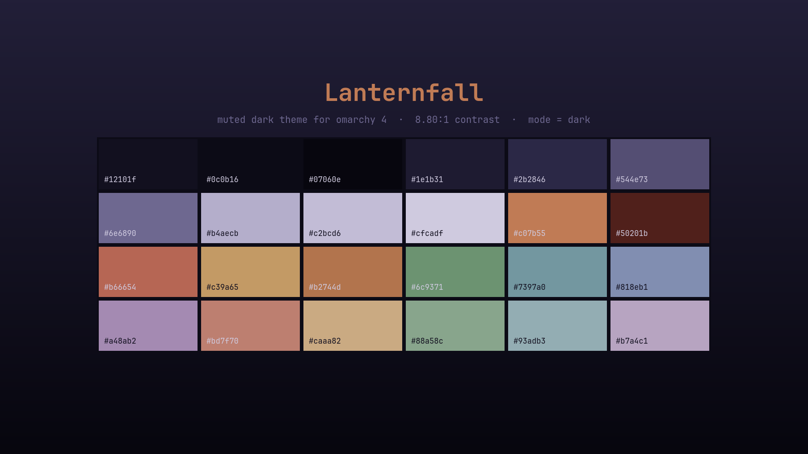

# Lanternfall

A muted dark theme for [Omarchy](https://omarchy.org) 4 (Quattro), derived from a
pixel-art night canyon: cold indigo shadows lit by warm paper lanterns.

The palette keeps that split. Everything structural is desaturated (cool ANSI
colors average 0.26 saturation); only the warm family carries heat (0.53), so the
accent reads as lantern light against a desaturated field.



## Install

```bash
omarchy theme install https://github.com/LizinDev/omarchy-lanternfall-theme.git
```

Or clone it anywhere and symlink it in — see *Working on it* below.

## Palette

| Role | Hex | |
|---|---|---|
| background | `#12101f` | terminals, bar, popups, menus |
| foreground | `#b4aecb` | all body text — 8.80:1 on background |
| accent | `#c07b55` | borders, shortcuts, selected rows |
| selection | `#2b2846` | text selection, btop meters |
| muted | `#544e73` | ANSI bright-black, dividers |

ANSI: `#b66654` red · `#6c9371` green · `#c39a65` yellow · `#818eb1` blue ·
`#a48ab2` magenta · `#7397a0` cyan.

Every pair is at least 14.3 ΔE apart, so terminal output stays readable despite
the low overall saturation. The neutral ramp reads strictly darkest to lightest,
as Omarchy's theming docs require for a dark theme.

## What's here

| File | |
|---|---|
| `colors.toml` | the palette — generates 17 app configs on its own |
| `hyprland.lua` | border gradient + a warm shadow on the focused window |
| `shell.{menu,launcher,tooltip,lock}.toml` | per-section shell overrides |
| `backgrounds/` | a palette-derived gradient (see *Backgrounds* below) |
| `preview.png` | theme-switcher tile |
| `unlock.png` | Plymouth boot splash and SDDM logo |

## Backgrounds

This repo ships only `3-lanternfall-void.png`, a plain gradient generated from the
palette. The theme was designed against a piece of pixel-art — a night canyon lit
by paper lanterns — but that is someone else's work and is not redistributed here.

To use it, find a dark pixel-art wallpaper you like and drop it in:

```bash
cp <your-wallpaper> ~/.config/omarchy/themes/lanternfall/backgrounds/1-lanternfall.png
omarchy theme set lanternfall
```

Backgrounds are picked in plain lexical order, so the numeric prefix decides which
one appears first. Cycle them with `Super + Ctrl + Space`.

If your wallpaper is a JPEG of pixel art, it is probably damaged — JPEG smears hard
pixel edges into thousands of intermediate colors. Find the native grid by
round-tripping (`-filter point` down by N and back up; lowest RMSE wins), then:

```bash
magick wall.jpg -statistic median 3x3 -filter point -resize <native>! \
  +dither -colors 192 -filter point -resize <N>00% wall-restored.png
```

Use `median` + point sampling rather than `-filter Box -resize`: Box's support
window is wider than the exact block, so it blends neighbouring native pixels and
destroys the intentional dithering most pixel art uses for gradients.

## Caveats

**Installed from a git clone, this theme loses `hyprland.lua`.** Omarchy drops
every `.lua`, terminal config and `vscode.json` from a cloned theme, because each
names something to run. You still get the palette and the border gradient (that
lives in `colors.toml`), but not the window shadows.

**`shell.*.toml` overrides replace their whole section, they don't merge.** Each
file here restates the complete section. The hex values in them are frozen copies
of `colors.toml` — re-sync them if you change the palette.

## Working on it

Keep the repo outside `~/.config/omarchy/themes` and symlink it in. A directory
with a `.git` inside is treated as somebody else's theme and staged under
restrictions; a symlink is not.

```bash
git clone <this-repo> ~/Projects/omarchy-lanternfall-theme
ln -s ~/Projects/omarchy-lanternfall-theme ~/.config/omarchy/themes/lanternfall
omarchy theme set lanternfall
```

Then iterate with `omarchy theme refresh`, which re-renders without touching the
wallpaper. `omarchy dev theme-preview colors.toml` prints the ramp and a
contrast reading.

## Credits

The palette was sampled from a scene in **Mark J. Ferrari's** *Seize the Day*
series — 8-bit colour-cycling and palette-shifting art drawn in Deluxe Paint II
between 1994 and 1996 for Seize The Day & Realtime Associates. His archive is at
<https://www.markferrari.com/image-archives>.

**His images are copyright © Mark J. Ferrari and explicitly marked "do not
redistribute", so none of that artwork is in this repository.** There is no
wallpaper here, and `preview.png` is a palette specimen rather than a crop of the
image. What this theme carries is a colour palette derived from the scene and then
hand-tuned for contrast and hue separation — the wallpaper itself you should get
from the artist's own archive.

If you like this palette, go look at his work. The colour-cycling pieces are worth
your time in motion, which a static theme cannot convey.

